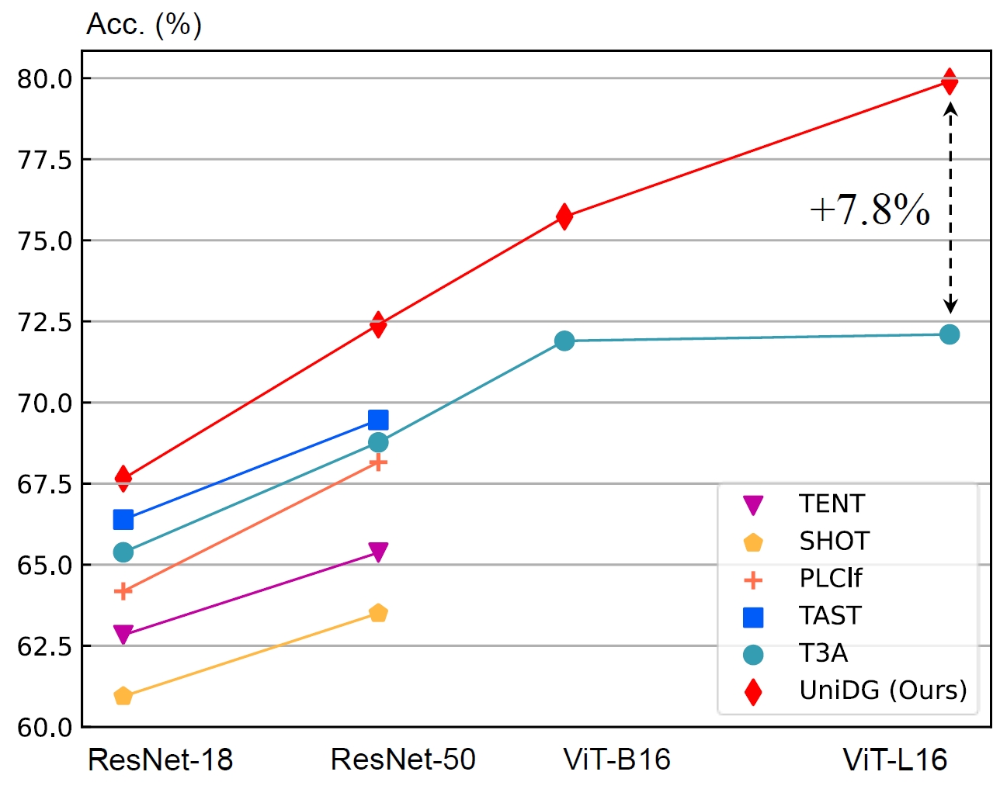
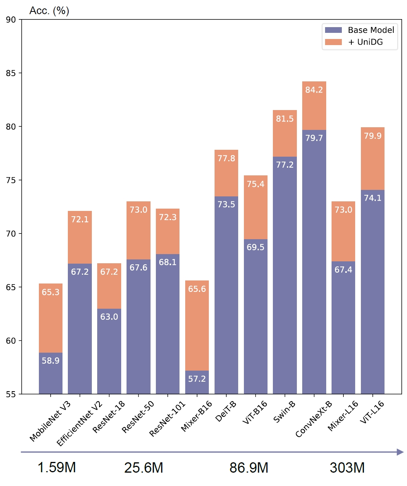
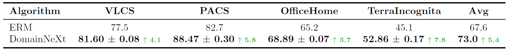
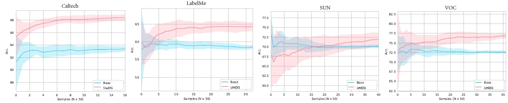
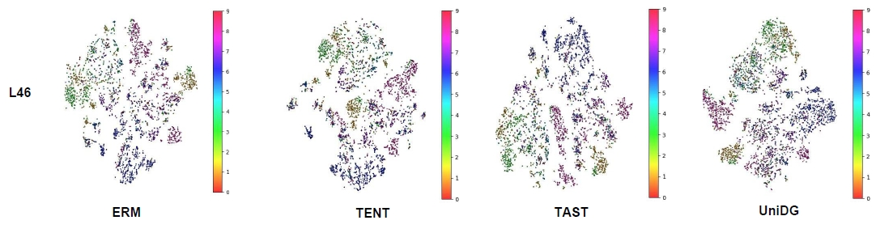

# *Towards Unified and Effective Domain Generalization*

<div align="center">
    <span class="author-block">
    <a href="https://invictus717.github.io/" target="_blank">Yiyuan Zhang</a><sup>1,2*</sup>,</span>
    <span class="author-block">
    <a href="https://kxgong.github.io/" target="_blank">Kaixiong Gong</a><sup>1,2*</sup>,</span>
    <span class="author-block">
    <a href="https://dingxiaohan.xyz/" target="_blank">Xiaohan Ding</a><sup>4</sup>,
    </span>
    </br>
    <a href='http://kpzhang93.github.io/' target='_blank'>Kaipeng Zhang</a><sup>2,†</sup>
    <span class="author-block">
    <a href="https://scholar.google.com/citations?user=tGxDe8sAAAAJ&hl=en&oi=ao" target="_blank">Fangrui Lv</a><sup>5</sup>,
    </span>
    <span class="author-block">
    <a href="https://people.eecs.berkeley.edu/~keutzer/" target="_blank">Kurt Keutzer</a><sup>3</sup>,
    </span>
    <span class="author-block">
    <a href="http://people.eecs.berkeley.edu/~xyyue/" target="_blank">Xiangyu Yue</a><sup>1†</sup>
    </span>
</div>

<div align="center">
    <sup>1</sup>
    <a href='http://mmlab.ie.cuhk.edu.hk/' target='_blank'>Multimedia Lab, The Chinese University of Hong Kong</a>&emsp;
    </br>
    <sup>2</sup> <a href='https://github.com/OpenGVLab' target='_blank'>OpenGVLab，Shanghai AI Laboratory 
    </a>
    <sup>3</sup> <a href='https://eecs.berkeley.edu/' target='_blank'>UC Berkeley</a>
    <sup>4</sup> <a href='https://ai.tencent.com/' target='_blank'>Tencent AI Lab</a>
    <sup>5</sup> <a href='https://ai.tencent.com/' target='_blank'>Tsinghua University</a>
    </br>
    <sup>*</sup> Equal Contribution&emsp;
    <sup>†</sup> Corresponding Authors&emsp;
</div>

-----------------
[](https://arxiv.org/abs/2310.10008)
[](https://invictus717.github.io/Generalization/)
[](https://www.apache.org/licenses/LICENSE-2.0)
<!--  -->
## Highlights ⭐⭐⭐
- 🚀 ***UniDG* is an effective Test-Time Adaptation scheme. It brings out an average improvement to existing DG methods by `+5.0%` Accuracy on DomainBed benchmarks including PACS, VLCS, OfficeHome, and TerraInc datasets.**
  
<p align="center" width="100%">

</p>

- 🚀 ***UniDG* is architecture-agnostic. Unified with 10+ visual backbones including CNN, MLP, and transformer-based models, UniDG can bring out consistent performance enhancement of `+5.4%` average on domain generalization.**

<p align="center" width="100%">

</p>

- 🏆 **Achieved `79.6 mAcc` on PACS , VLCS , OfficeHome, TerraIncognita , and DomainNet datasets.**

### Abstract

We propose UniDG, a novel and Unified framework for Domain Generalization that is capable of significantly enhancing the out-of-distribution generalization
performance of foundation models regardless of their architectures. The core
idea of UniDG is to finetune models during the inference stage, which saves
the cost of iterative training. Specifically, we encourage models to learn the
distribution of test data in an unsupervised manner and impose a penalty regarding the updating step of model parameters. The penalty term can effectively reduce the catastrophic forgetting issue as we would like to maximally preserve the valuable knowledge in the original model. Empirically, across 12 visual backbones, including CNN-, MLP-, and Transformer-based models, ranging
from 1.89M to 303M parameters, UniDG shows an average accuracy improvement of +5.4% on DomainBed. 

## Features 🎉🎉🎉

1. 🌟 ***Extensibility***:  we intergrate ***UniDG*** with Domainbed. More networks and algorithms can be built easily with our framework, and UniDG brings out an average improvement of `+5.0%` to existing methods including ERM, CORAL, and MIRO.

2. 🌟 ***Reproducibility***: all implemented models are trained on various tasks at least three times. Mean±std is provided in the [UniDG paper](https://arxiv.org/abs/2310.10008). *Pretrained models and logs* are available.

3. 🌟 ***Ease of Use***:  we develop tools to charge experimental logs with json files, which can transform results directly into latex:

   

4. 🌟 ***Visualization Tools***: we provides scripts to easily visualize results by T-SNE and performance curves:
    * Convergence Curves:
   
   

   * T-SNE Visualization Results:

   

## Model Zoo for UniDG

We provide pretrained checkpoints with base `ERM` algorithm to reproduce our experimental results conveniently.

*Note that `IID_best.pkl` is the pretrained source model.*

* CORAL Source Models

| Backbone         |                Dataset                | Algorithm |  Base Model  |   Adaptation |                       Google Drive                          |
| ---------------- | :-----------------------------------: | :-------: | :-------: | :--------: | :----------------------------------------------------------: |
| ResNet-50        | VLCS \| PACS \| OfficeHome \| TerraInc\| DomainNet |    CORAL    | 64.1 ± 0.1 | 69.3 ± 0.2 | [ckpt](https://drive.google.com/drive/folders/1-Vis3Ge_DhhU10YqsYUU_Y-9KAzKZ92w?usp=drive_link) |
| Swin Transformer        | VLCS \| PACS \| OfficeHome \| TerraInc |    CORAL    | 77.2 ± 0.1 | 82.5 ± 0.2 | [ckpt](https://drive.google.com/drive/folders/1OKn_wd7pDjoIxhB_G38CkBMUr5MvEAdt?usp=sharing) |
| ConvNeXt       | VLCS \| PACS \| OfficeHome \| TerraInc\| DomainNet |    CORAL    | 75.1 ± 0.1 | 79.6 ± 0.3 | [ckpt](https://drive.google.com/drive/folders/1xt3J_kfe8pEDZ8CjeX5CCexS5F5owLbP?usp=sharing) |

* ERM Source Models 

| Backbone         |                Dataset                | Algorithm |  Base Model  |   Adaptation |                        Google Drive                          |
| ---------------- | :-----------------------------------: | :-------: | :-------: | :--------: | :----------------------------------------------------------: | 
| ResNet-18        | VLCS \| PACS \| OfficeHome \| TerraInc |    ERM    | 63.0 ± 0.0 | 67.2 ± 0.2 |[ckpt](https://drive.google.com/drive/folders/1dF9TsKuLOIU_ii8jfDka4FitXlYGgO8D?usp=share_link) |
| ResNet-50        | VLCS \| PACS \| OfficeHome \| TerraInc |    ERM    | 67.6 ± 0.0 | 73.1 ± 0.2 | [ckpt](https://drive.google.com/drive/folders/15d8EPsOMmN0q8NHKD6GQA1GfHaxY4jMN?usp=share_link) |
| ResNet-101       | VLCS \| PACS \| OfficeHome \| TerraInc |    ERM    | 68.1 ± 0.1 | 72.3 ± 0.3 | [ckpt](https://drive.google.com/drive/folders/1TEA46H9JfDGBPhc7cGatYSDuBV63jCoQ?usp=share_link) |
| Mobilenet V3     | VLCS \| PACS \| OfficeHome \| TerraInc |    ERM    | 58.9 ± 0.0 | 65.3 ± 0.2 | [ckpt](https://drive.google.com/drive/folders/1EJrwFIkihcIubznVeLNYp5UwCWSNqIdv?usp=share_link) |
| EfficientNet V2  | VLCS \| PACS \| OfficeHome \| TerraInc |    ERM    | 67.2 ± 0.0 | 72.1 ± 0.3 | [ckpt](https://drive.google.com/drive/folders/1a3wwAo4LKiG9BrETw0lkn3mdXtnUQVHU?usp=share_link) |
| ConvNeXt-B       | VLCS \| PACS \| OfficeHome \| TerraInc |    ERM    | 79.7 ± 0.0 | 83.7 ± 0.1 |[ckpt](https://drive.google.com/drive/folders/1p1b0ZUn8oT-tc9JCb1G8r5E0R7l2zVE6?usp=share_link) |
| ViT-B16          | VLCS \| PACS \| OfficeHome \| TerraInc |    ERM    | 69.5 ± 0.0 | 75.4 ± 0.2 | [ckpt](https://drive.google.com/drive/folders/1okU78l0POKLg7m1q-c07Xhpd0tGa6Awl?usp=share_link) |
| ViT-L16          | VLCS \| PACS \| OfficeHome \| TerraInc |    ERM    | 74.1 ± 0.0 | 79.9 ± 0.3 |[ckpt](https://drive.google.com/drive/folders/1EfNN4H1ZQCO6xnOvxRleMgJdMmDXLL-M?usp=share_link) |
| DeiT             | VLCS \| PACS \| OfficeHome \| TerraInc |    ERM    | 73.5 ± 0.0 | 77.8 ± 0.2 | [ckpt](https://drive.google.com/drive/folders/1XwAfBPCTana7LP8wnp48wzzO-H66nEXB?usp=share_link) |
| Swin Transformer | VLCS \| PACS \| OfficeHome \| TerraInc |    ERM    | 77.2 ± 0.0 | 81.5 ± 0.3 | [ckpt](https://drive.google.com/drive/folders/1fhp-jXJZU4VORguDupoGTEpKd6TeErS9?usp=share_link) |
| Mixer-B16        | VLCS \| PACS \| OfficeHome \| TerraInc |    ERM    | 57.2 ± 0.1 | 65.6 ± 0.3 | [ckpt](https://drive.google.com/drive/folders/1myX-InLRTkKYC4akK1LmJeIfcAc5SZ6u?usp=share_link) |
| Mixer-L16        | VLCS \| PACS \| OfficeHome \| TerraInc |    ERM    | 67.4 ± 0.0 |  73.0 ± 0.2 |[ckpt](https://drive.google.com/drive/folders/1o-T93TscEEe1m9ZZBfpUfslMQ74Mhn9c?usp=share_link) |


## 🔧 Get Started

Environments Set up

```sh
git clone https://github.com/invictus717/UniDG.git && cd UniDG
conda env create -f UniDG.yaml &&  conda activate UniDG
```

Datasets Preparation

```sh
python -m domainbed.scripts.download \
       --data_dir=./data
```

## ⏳ Training & Test-time adaptation

Train a model:

```sh
python -m domainbed.scripts.train\
       --data_dir=./data \
       --algorithm ERM \
       --dataset OfficeHome \
       --test_env 2 \
       --hparams "{\"backbone\": \"resnet50\"}" \
       --output_dir my/pretrain/ERM/resnet50
```

*Note that you can download our pretrained checkpoints in the [Model Zoo](https://github.com/invictus717/UniDG#model-zoo-for-unidg).*

Then you can perform self-supervised adaptation:

```shell
python -m domainbed.scripts.unsupervised_adaptation \
       --input_dir my/pretrain/ERM/resnet50 \
       --adapt_algorithm=UniDG
```

## 📆 Collect Experimental Results

Then you can perform self-supervised adaptation:

```shell
python -m domainbed.scripts.collect_all_results\
       --input_dir=my/pretrain/ERM \
       --adapt_dir=results/ERM/resnet50 \
       --output_dir=log/UniDG/ \
       --adapt_algorithm=UniDG \
       --latex
```

## 📈 Visualization results

For T-SNE visualization: 

```bash
python -m domainbed.scripts.visualize_tsne\
       --input_dir=my/pretrain/ERM \
       --adapt_dir=UniDG/results/ERM/resnet50 \
       --output_dir=log/UniDG/ \
       --adapt_algorithm=UniDG \
       --latex
```

For performance curves visualization: 

```bash
python -m domainbed.scripts.visualize_curves\
       --input_dir=my/pretrain/ERM \
       --adapt_dir=UniDG/results/ERM/resnet50 \
       --output_dir=log/UniDG/ \
       --adapt_algorithm=UniDG \
       --latex
```


## Citation

If this work is helpful for your research, please consider citing the following BibTeX entry.

```
@article{zhang2023unified,
      title={Towards Unified and Effective Domain Generalization}, 
      author={Yiyuan Zhang and Kaixiong Gong and Xiaohan Ding and Kaipeng Zhang and Fangrui Lv and Kurt Keutzer and Xiangyu Yue},
      year={2023},
      eprint={2310.10008},
      archivePrefix={arXiv},
      primaryClass={cs.CV}
}
```

## Acknowledge

This repository is based on [DomainBed](https://github.com/facebookresearch/DomainBed), [T3A](https://github.com/matsuolab/T3A), [timm](https://github.com/fastai/timmdocs). Thanks a lot for their great works!

## License

This repository is released under the Apache 2.0 license as found in the [LICENSE](https://www.apache.org/licenses/LICENSE-2.0) file.